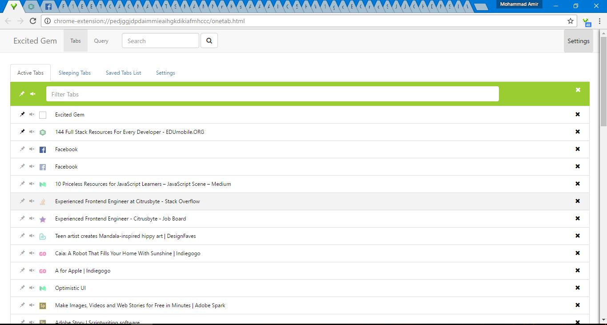

Big thanks to [BrowserStack](http://browserstack.com/) for the support. Because Excited gem is an extension for browsers, there was need to test the UI and features in multiple browsers across multiple devices and OS. There is where [BrowserStack](http://browserstack.com/) comes in. I am using [BrowserStack](http://browserstack.com/) for to test my extension on different browsers.
# Excited Gem

This repo is a quest to improve the famous extension for Chrome "OneTab" with respect to UI and UX along with some more useful options for regular Chrome/Firefox users and developers/programmers.

## Idea
The thought to make such a thing happened when I faced few problems while using Chrome browser. I love to read and research a lot. And while doing that I end opening more than 50 tabs. Mostly 60 or 70. It is then when I start having problem of managing my tabs. With so many tabs stacked up, it was hard to know which tab was which. Sometimes I accidently closed a tab in try to select it.

I could have gone with some simple solutions like move all my opened tabs to bookmarks and open them later when need it. Then I found an nice Chrome extension "One Tab". It was doing a great job. In fact part of the reason and inspiration to make this project came from that extension.

So I decided to make something useful and also learn something new while making it. That is how I started building it and learned quite a bit about Javascript, Chrome Extension API, ReactJS and Typescript.

## Visuals
### Main
In the Following screen you can see all the tabs that have been opened in the current browser window. The Active Tabs list show you not only the currently opened tabs but also their attributes like whether it is pinned or not, whether it is audible or not.
You can make a tab pinned or mute a tab, or go to a tab by clicking on its link(name).

  

The Active Tabs list keep changing , every time the tabs are either moved , removed or created, pinned or muted.

The total number of tabs for current window is shown on the extension icon (top right next to address bar).

### Filtering

Currently this extension support two types of filtering for Active Tabs.  
1. Normal (String/text search)
2. Regex/Regular Expressions

The filtering is case Insensitive for now. But I shall soon add option to quickly toggle that.

For now that was it. Got of future plans for this project. Shall keep you updated.

from Pakistan with LOVE.
